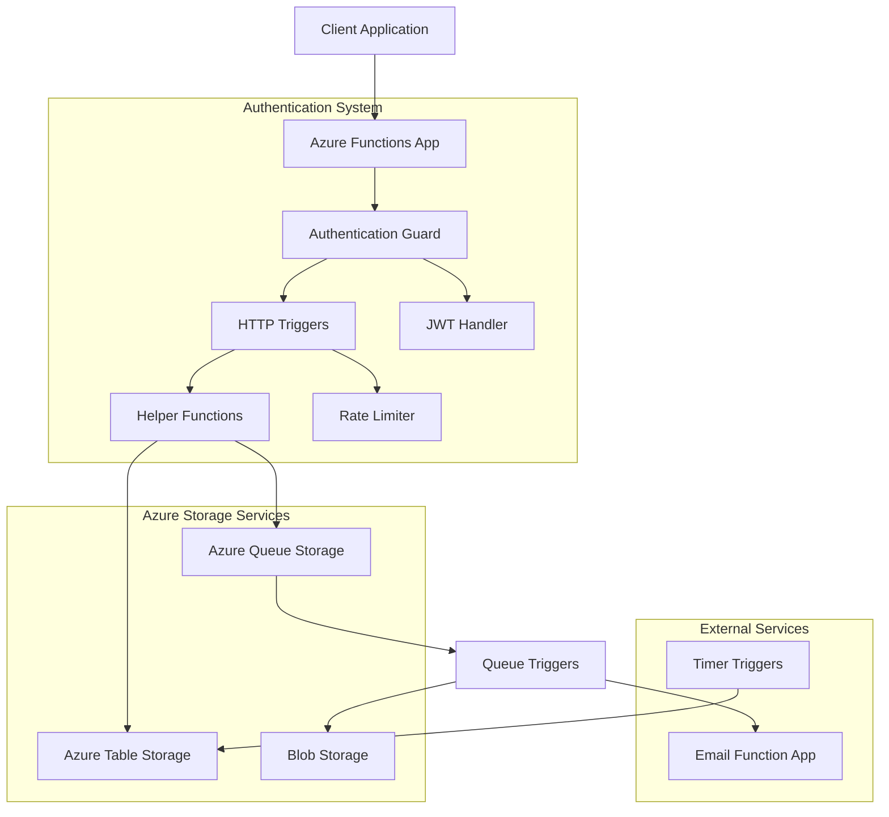
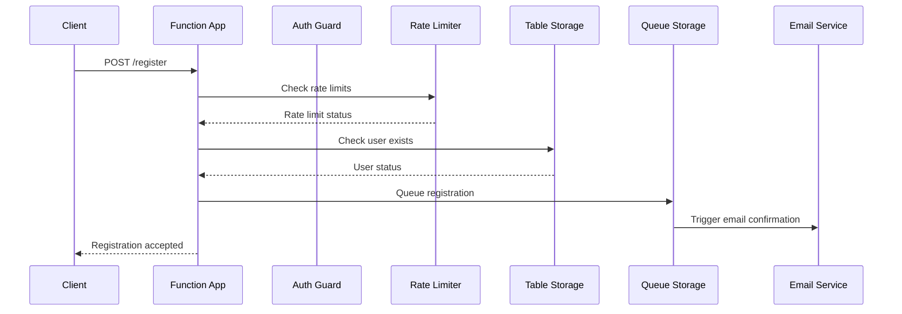
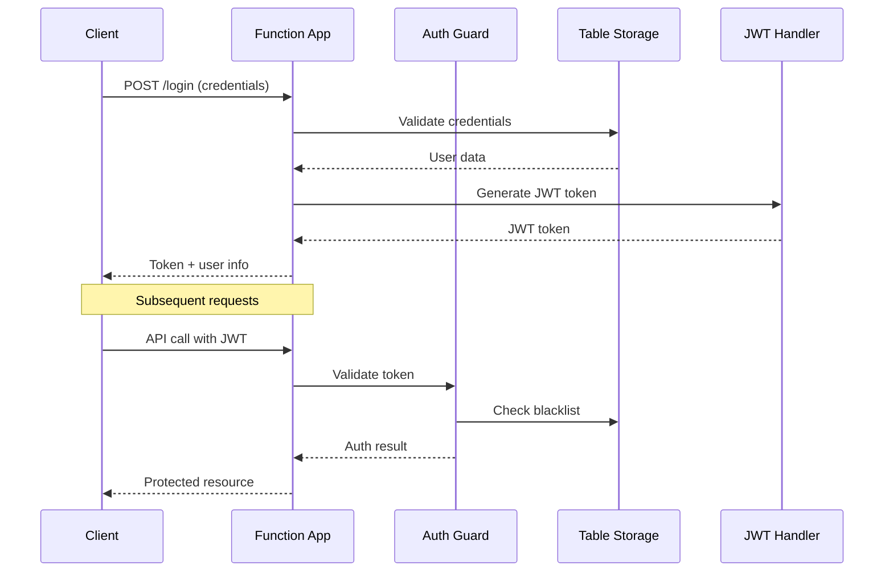

# 🏗️ System Architecture

## 📖 Overview
The Authentication Function App is a serverless, cloud-native authentication system built on Azure Functions v4 with Python v2 programming model. It provides a complete user authentication and authorization solution featuring JWT-based security, rate limiting, email verification, and asynchronous processing through Azure Queues.

---

## 🏛️ High-Level Architecture



The system employs a microservices architecture where authentication functions operate independently while leveraging shared Azure storage services for data persistence and inter-service communication.

---

## 🧩 Core Components

### HTTP Triggers Layer
- **Purpose**: Handles incoming authentication requests from client applications
- **Technology**: Azure Functions v4, Python v2 programming model
- **Location**: `function_app.py`
- **Responsibilities**:
  - User registration and login processing
  - Password management (change, reset, forgot)
  - Email verification and confirmation
  - User account management (delete, logout)
  - Session management and token handling

### Authentication Guard
- **Purpose**: Centralized JWT token validation and authorization
- **Technology**: Python decorators, PyJWT library
- **Location**: `guard.py`
- **Responsibilities**:
  - JWT token verification and validation
  - Token blacklisting for logout functionality
  - Authorization checks for protected endpoints
  - Request authentication middleware

### Helper Functions Module
- **Purpose**: Reusable utility functions for common operations
- **Technology**: Python, Azure SDK libraries
- **Location**: `helper_functions.py`
- **Responsibilities**:
  - Input validation and sanitization
  - Password hashing and verification
  - Email format validation
  - Azure Table Storage operations
  - User data management utilities

### Rate Limiting System
- **Purpose**: Prevents abuse and DDoS attacks through request throttling
- **Technology**: Python, Azure Table Storage
- **Location**: `rate_limit.py`
- **Responsibilities**:
  - User-based rate limiting (by username/email)
  - IP-based rate limiting
  - Configurable rate limit policies
  - Rate limit tracking and enforcement

---

## 🔄 Data Flow Architecture

### User Registration Flow


### Authentication Flow


---

## 🗄️ Data Architecture

### Azure Table Storage Schema

#### Users Table
```python
{
    "PartitionKey": "user",
    "RowKey": "{username}",
    "email": "user@example.com",
    "password_hash": "hashed_password",
    "first_name": "John",
    "last_name": "Doe",
    "is_verified": false,
    "confirmation_token": "token_string",
    "created_at": "2024-01-01T00:00:00Z",
    "last_login": "2024-01-01T00:00:00Z",
    "ip_address": "192.168.1.1"
}
```

#### Rate Limit Tables
```python
# User rate limits
{
    "PartitionKey": "rate_limit_user",
    "RowKey": "{username_or_email}",
    "request_count": 5,
    "window_start": "2024-01-01T00:00:00Z"
}

# IP rate limits
{
    "PartitionKey": "rate_limit_ip",
    "RowKey": "{ip_address}",
    "request_count": 10,
    "window_start": "2024-01-01T00:00:00Z"
}
```

#### Token Blacklist
```python
{
    "PartitionKey": "blacklisted_tokens",
    "RowKey": "{jwt_token_hash}",
    "blacklisted_at": "2024-01-01T00:00:00Z",
    "expires_at": "2024-01-01T01:00:00Z"
}
```

---

## 🔧 Integration Points

### Queue-Based Communication
- **User Action Queue**: Asynchronous processing of user operations
- **Email Queue**: Integration with external email service
- **Message Format**: JSON-serialized user data and action types

### External Dependencies
- **Email Function App**: Separate Azure Function for email operations
- **Client Applications**: Web and mobile apps consuming the API
- **Azure Services**: Table Storage, Queue Storage, Application Insights

---

## 🛡️ Security Architecture

### Authentication & Authorization
- **JWT Tokens**: Stateless authentication with configurable expiration
- **Token Blacklisting**: Secure logout and session invalidation
- **Password Security**: BCrypt hashing with salt

### Rate Limiting Strategy
- **Multi-tier Protection**: User-level and IP-level rate limiting
- **Configurable Policies**: Flexible rate limit configuration
- **DDoS Protection**: IP-based blocking for suspicious activity

### Data Protection
- **Input Validation**: Comprehensive sanitization of user inputs
- **Email Verification**: Account activation through email confirmation
- **Secure Headers**: CORS and security headers configuration

---

## 📊 Performance Considerations

### Scalability Features
- **Serverless Architecture**: Auto-scaling based on demand
- **Asynchronous Processing**: Non-blocking operations through queues
- **Stateless Design**: Horizontal scaling capability

### Optimization Strategies
- **Connection Pooling**: Efficient Azure service connections
- **Caching**: Token validation caching where applicable
- **Minimal Dependencies**: Lean runtime for faster cold starts

---

## 🚀 Deployment Architecture

### Environment Configuration
- **Local Development**: Azure Functions Core Tools with local storage emulator
- **Staging/Production**: Azure cloud deployment with managed services
- **Configuration Management**: Environment variables and Azure Key Vault

### CI/CD Pipeline Requirements
- **Build Process**: Python package installation and dependency management
- **Testing**: Unit tests and integration tests
- **Deployment**: Azure Functions deployment with infrastructure as code

---

## 🔍 Monitoring & Observability

### Logging Strategy
- **Application Insights**: Comprehensive telemetry and monitoring
- **Structured Logging**: JSON-formatted logs for better searchability
- **Error Tracking**: Exception handling and error reporting

### Health Checks
- **Function Health**: Azure Functions runtime monitoring
- **Storage Health**: Azure Table and Queue storage connectivity
- **Performance Metrics**: Response times and throughput monitoring

---

## 🎯 Design Decisions & Trade-offs

### Technology Choices
- **Azure Functions v4**: Latest features and improved performance
- **Python v2 Model**: Simplified development and better maintainability
- **JWT over Sessions**: Stateless authentication for better scalability
- **Table Storage**: Cost-effective NoSQL solution for user data

### Trade-offs Considered
- **Consistency vs Availability**: Eventual consistency for better performance
- **Security vs Usability**: Balance between strong security and user experience
- **Cost vs Performance**: Serverless pricing model vs dedicated resources
- **Simplicity vs Features**: Core authentication features vs advanced capabilities

---

## 🔮 Future Enhancements

### Planned Improvements
- **OAuth Integration**: Social login providers (Google, Microsoft, GitHub)
- **Multi-factor Authentication**: SMS and TOTP-based 2FA
- **Advanced Rate Limiting**: Machine learning-based anomaly detection
- **API Versioning**: Backward-compatible API evolution

### Scalability Roadmap
- **Database Migration**: Transition to Azure Cosmos DB for global distribution
- **Caching Layer**: Redis implementation for high-frequency operations
- **CDN Integration**: Geographic distribution for better performance
- **Microservices Split**: Separate services for specialized authentication features
