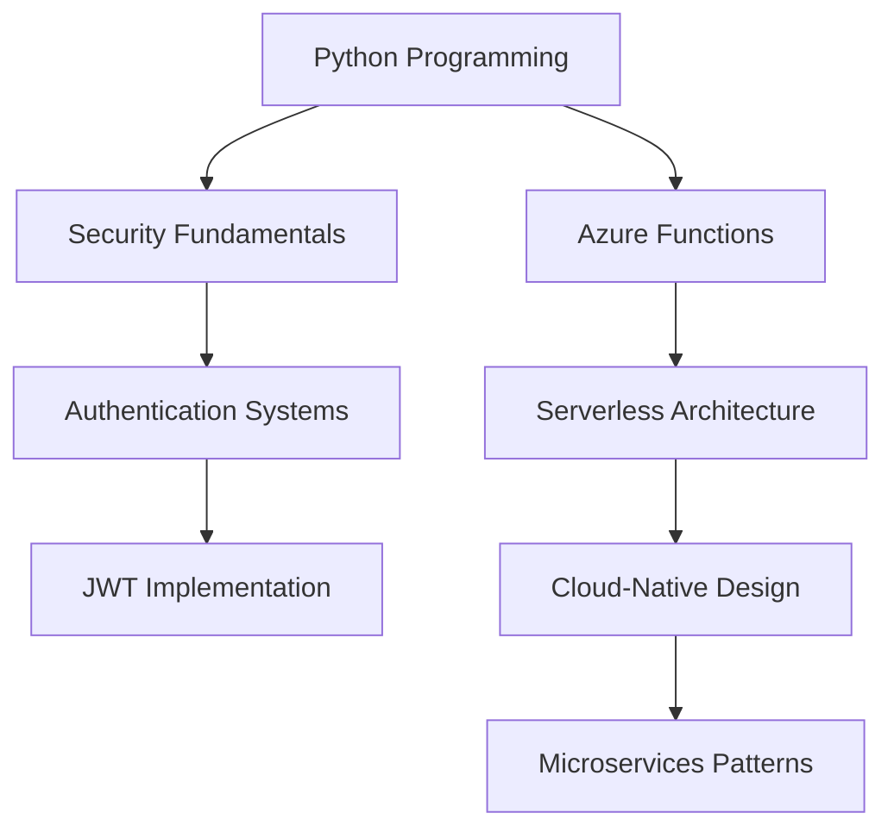

# 🎯 Skills & Competencies Index

## 📖 Overview
This document catalogs the comprehensive set of skills and competencies developed through the Authentication Function App project. It serves as a reference for learners, educators, and professionals to understand the scope and depth of skills acquired in serverless authentication systems, cloud-native development, and Azure services integration.

---

## 🏗️ Core Technical Skills

### Serverless Computing & Azure Functions
- **Azure Functions v4**: Modern serverless compute platform with Python v2 programming model | *Demonstrated in: [function_app.py]*
- **Function Triggers**: HTTP triggers, queue triggers, and timer triggers implementation | *Demonstrated in: [function_app.py, queue_triggers.py, active_cron_trigger.py]*
- **Function App Configuration**: Host.json configuration and extension bundles management | *Demonstrated in: [host.json]*
- **Cold Start Optimization**: Efficient function design for minimal startup time | *Demonstrated in: [requirements.txt, function_app.py]*
- **Serverless Architecture Patterns**: Event-driven and microservices design patterns | *Demonstrated in: [ARCHITECTURE.md]*

### Cloud-Native Development
- **Azure SDK Integration**: Azure Tables, Queue Storage, and service clients | *Demonstrated in: [helper_functions.py, function_app.py]*
- **Environment Configuration**: Azure App Settings and local development setup | *Demonstrated in: [host.json, requirements.txt]*
- **Connection String Management**: Secure configuration of Azure service connections | *Demonstrated in: [function_app.py]*
- **Resource Management**: Efficient Azure service client lifecycle management | *Demonstrated in: [helper_functions.py]*
- **Error Handling**: Cloud service exception handling and resilience patterns | *Demonstrated in: [guard.py, helper_functions.py]*

### Authentication & Security
- **JWT Token Management**: Token generation, validation, and expiration handling | *Demonstrated in: [guard.py, function_app.py]*
- **Password Security**: BCrypt hashing, salt generation, and secure storage | *Demonstrated in: [helper_functions.py]*
- **Session Management**: Stateless authentication and token blacklisting | *Demonstrated in: [guard.py]*
- **Input Validation**: Data sanitization and security validation | *Demonstrated in: [helper_functions.py]*
- **Authentication Patterns**: Decorator-based authentication guards | *Demonstrated in: [guard.py]*

### Data Management & Storage
- **Azure Table Storage**: NoSQL data modeling and CRUD operations | *Demonstrated in: [helper_functions.py]*
- **Data Validation**: Input validation and data integrity checks | *Demonstrated in: [helper_functions.py]*
- **Schema Design**: User data structure and table relationships | *Demonstrated in: [helper_functions.py]*
- **Query Optimization**: Efficient table storage queries and filters | *Demonstrated in: [helper_functions.py]*
- **Data Migration**: User data management and updates | *Demonstrated in: [helper_functions.py]*

---

## 🔧 Technical Implementation Skills

### API Development & Design
- **RESTful API Design**: *[function_app.py]* – HTTP methods, status codes, and endpoint structure
- **Request/Response Handling**: *[function_app.py]* – JSON parsing, validation, and response formatting
- **Error Response Patterns**: *[function_app.py, guard.py]* – Consistent error handling and HTTP status codes
- **API Documentation**: *[README.md]* – Endpoint documentation and usage examples
- **Route Configuration**: *[function_app.py]* – Function routing and HTTP trigger configuration

### Asynchronous Processing
- **Queue-Based Architecture**: *[queue_triggers.py]* – Azure Queue Storage integration for async processing
- **Message Processing**: *[queue_triggers.py]* – Queue trigger implementation and message handling
- **Event-Driven Design**: *[active_cron_trigger.py]* – Timer-based triggers for scheduled operations
- **Service Integration**: *[function_app.py]* – Cross-service communication through queues
- **Workflow Orchestration**: *[function_app.py]* – Multi-step process coordination

### Security Implementation
- **Rate Limiting Systems**: *[rate_limit.py]* – User and IP-based request throttling
- **Token Blacklisting**: *[guard.py]* – Secure logout and session invalidation
- **Email Verification**: *[helper_functions.py]* – Account activation and confirmation tokens
- **Security Middleware**: *[guard.py]* – Authentication decorator and request interception
- **Cryptographic Operations**: *[helper_functions.py]* – Password hashing and token generation

### Testing & Quality Assurance
- **Unit Testing**: *[tests/test_helper_functions.py]* – Function-level testing with pytest
- **Integration Testing**: *[tests/test_queue_triggers.py]* – Service integration testing
- **API Testing**: *[tests/test_login.sh, tests/test_register.sh]* – Shell script-based API testing
- **Test Automation**: *[tests/]* – Comprehensive test suite development
- **Quality Metrics**: *[requirements.txt]* – Dependency management and testing frameworks

### Performance & Optimization
- **Connection Pooling**: *[helper_functions.py]* – Efficient Azure service client management
- **Caching Strategies**: *[guard.py]* – Token validation optimization
- **Resource Efficiency**: *[function_app.py]* – Memory and compute optimization
- **Scalability Patterns**: *[ARCHITECTURE.md]* – Horizontal scaling design
- **Monitoring Integration**: *[host.json]* – Application Insights configuration

---

## 🌐 Domain-Specific Skills

### User Experience & Interface Design
- **Registration Workflows**: Complete user onboarding process with email verification
- **Password Management**: Secure password reset and change functionality
- **Session Handling**: Seamless login/logout user experience
- **Error Messaging**: User-friendly error responses and validation feedback
- **API Usability**: Developer-friendly API design and documentation

### System Administration & DevOps
- **Configuration Management**: Environment-specific settings and secrets handling
- **Deployment Strategies**: Azure Functions deployment and configuration
- **Monitoring Setup**: Application Insights integration and logging
- **Security Hardening**: Rate limiting and abuse prevention
- **Performance Tuning**: Function optimization and resource management

### Database Administration
- **NoSQL Design**: Azure Table Storage schema design and optimization
- **Data Integrity**: Validation rules and constraint implementation
- **Backup Strategies**: Data persistence and recovery planning
- **Query Performance**: Efficient data retrieval and indexing strategies
- **Migration Planning**: Data structure evolution and updates

---

## 🚀 Professional & Soft Skills

### Project Management
- **Requirements Analysis**: Feature specification and scope definition
- **Technical Documentation**: Comprehensive architecture and API documentation
- **Code Organization**: Modular design and separation of concerns
- **Version Control**: Git-based development workflow
- **Quality Assurance**: Testing strategies and code review processes

### Problem-Solving & Design
- **System Architecture**: End-to-end system design and component interaction
- **Security Analysis**: Threat modeling and vulnerability assessment
- **Performance Engineering**: Scalability planning and optimization strategies
- **Trade-off Analysis**: Technical decision-making and compromise evaluation
- **Innovation**: Creative solutions for complex authentication challenges

### Communication & Collaboration
- **Technical Writing**: Clear documentation and code comments
- **API Design**: Developer-focused interface design
- **Knowledge Sharing**: Educational content creation and skill transfer
- **Cross-functional Work**: Integration with external services and teams
- **Mentoring**: Code examples and best practices demonstration

---

## 🎓 Learning Outcomes & Competency Levels

### Beginner to Intermediate
- **Azure Functions Basics**: Function creation, triggers, and basic configuration
- **Authentication Fundamentals**: JWT tokens, password hashing, and session management
- **Python Development**: Object-oriented programming and module organization
- **API Development**: HTTP request handling and JSON response formatting
- **Testing Basics**: Unit test creation and validation strategies

### Intermediate to Advanced
- **Serverless Architecture**: Event-driven design and microservices patterns
- **Security Implementation**: Advanced authentication patterns and rate limiting
- **Cloud Integration**: Multi-service Azure architecture and service communication
- **Performance Optimization**: Scalability patterns and resource efficiency
- **Production Readiness**: Monitoring, logging, and error handling

### Advanced Competencies
- **System Design**: Complete authentication system architecture
- **Security Engineering**: Comprehensive security model implementation
- **DevOps Integration**: CI/CD pipeline design and deployment automation
- **Scalability Engineering**: High-availability and global distribution planning
- **Technical Leadership**: Architecture decisions and best practices establishment

---

## 🔗 Skill Relationships & Dependencies

### Core Dependencies

### Advanced Skill Paths
- **Security Specialist**: JWT → Rate Limiting → Advanced Auth → Security Architecture
- **Cloud Architect**: Azure Functions → Serverless → Microservices → System Design
- **Backend Engineer**: API Development → Database Design → Performance → Scalability
- **DevOps Engineer**: Configuration → Deployment → Monitoring → Automation

---

## 📈 Skill Progression Indicators

### Demonstrated Proficiencies
- ✅ **Serverless Development**: Production-ready Azure Functions implementation
- ✅ **Security Implementation**: Comprehensive authentication and authorization system
- ✅ **Cloud Integration**: Multi-service Azure architecture
- ✅ **API Design**: RESTful service with proper error handling
- ✅ **Testing Strategy**: Unit and integration test coverage

### Areas for Enhancement
- 🔄 **OAuth Integration**: Social login providers and federated authentication
- 🔄 **Advanced Monitoring**: Custom metrics and alerting systems
- 🔄 **CI/CD Pipeline**: Automated deployment and testing workflows
- 🔄 **Global Scale**: Multi-region deployment and data replication
- 🔄 **Advanced Security**: Multi-factor authentication and threat detection

---

## 📚 Recommended Learning Paths

### For Security Focus
1. Study JWT specifications and security best practices
2. Implement OAuth 2.0 and OpenID Connect
3. Learn about threat modeling and security testing
4. Explore Azure Security Center and Key Vault integration

### For Architecture Focus
1. Design patterns for microservices and serverless
2. Event-driven architecture and message queuing
3. Database design and data modeling
4. System scalability and performance optimization

### For DevOps Focus
1. Infrastructure as Code with ARM templates or Terraform
2. CI/CD pipeline design with Azure DevOps
3. Monitoring and alerting with Application Insights
4. Container orchestration and Kubernetes integration
